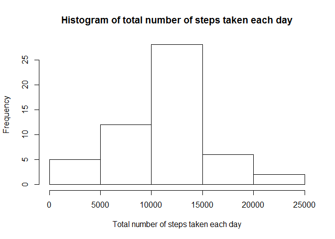
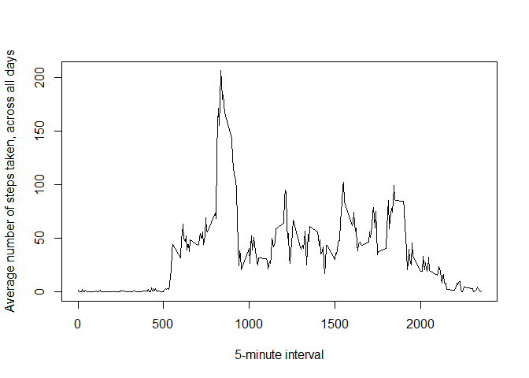
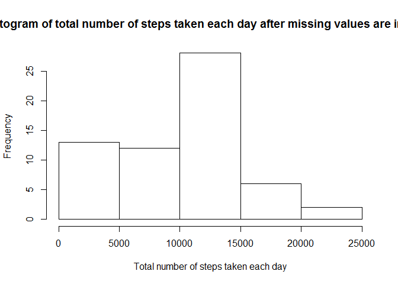
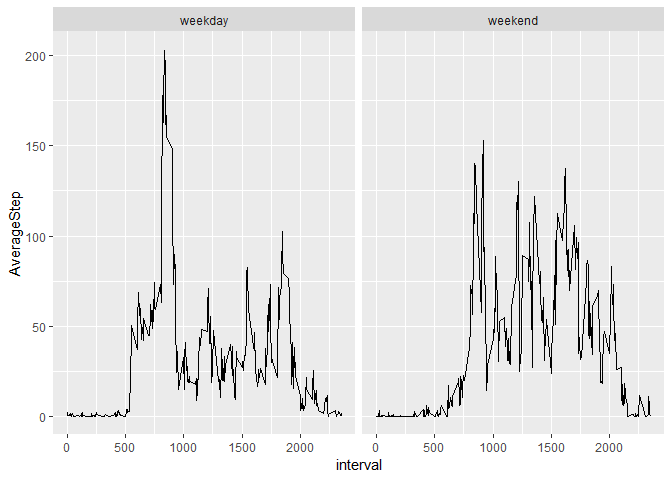

## Loading and preprocessing the data

### 1. Load the data
Set working directory and load data by read.csv. The loaded data is called 'activity_data'.


```r
setwd("d:/users/wittha/Documents/RStudio/Module 5_Week 2/")
activity_data <- read.csv("activity.csv", header = TRUE, sep = ",",stringsAsFactors=FALSE, na.strings="NA")
```

### 2. Process/transform the data into a format suitable for analysis
The only data that needs to be transformed is date. Use as.date function to change string to date format.


```r
activity_data$date <- as.Date(activity_data$date, "%Y-%m-%d")
```


## What is mean total number of steps taken per day?

### 1. Calculate the total number of steps taken per day
First, calculate total number of steps taken per day by pipeline operation in dplyr package. The activity_data is summaries by date and the summary which is a sum of steps in each day is stored in 'DailySteps'.


```r
library(dplyr)
DailySteps <- activity_data %>% group_by(date) %>% summarise(TotalSteps = sum(steps))
```

### 2. Make a histogram of total number of steps taken each day
Use base package to plot histogram of total number of steps taken each day


```r
library(dplyr)
hist(DailySteps$TotalSteps,main = "Histogram of total number of steps taken each day", xlab="Total number of steps taken each day")
```

<!-- -->

### 3. Calculate and report the mean and median of total number of steps taken per day
Calculate mean of total number of steps taken per day. Note: activity_data has NAs which will cause errors in calculation. To fix this, set na.rm=TRUE. 


```r
mean(DailySteps$TotalSteps, na.rm=TRUE)
```

```
## [1] 10766.19
```
 
Calculate median of total number of steps taken per day. Note: activity_data has NAs which will cause errors in calculation. To fix this, set na.rm=TRUE. 


```r
median(DailySteps$TotalSteps, na.rm=TRUE)
```

```
## [1] 10765
```
 


## What is the average daily activity pattern?
### 1. Make a time series plot (i.e. type="l") of the 5-minute interval (x-axis) and the average number of steps taken, averaged across all days (y-axis)
Start with calculating average number of steps by pipeline operation. Group dat by interval and calculate average (mean). Once average number of steps per each 5-minute interval is calculated, plot a line chart using base package.


```r
AverageSteps <- activity_data %>% group_by(interval) %>% summarise(AverageStep = mean(steps, na.rm = TRUE))
plot(AverageSteps$interval, AverageSteps$AverageStep, type="l",xlab = "5-minute interval",ylab = "Average number of steps taken, across all days")
```

<!-- -->

### 2. Which 5-minute interval, on average across all the days in the dataset, contains the maximum number of steps?
Use which.max to find the interval which has the maximum number of average steps.


```r
AverageSteps$interval[which.max(AverageSteps$AverageStep)]
```

```
## [1] 835
```


## Imputing missing values
### 1. Calculate and report the total number of missing values in the dataset (i.e. the total number of rows with NAs)


```r
sum(is.na(activity_data$steps))
```

```
## [1] 2304
```

### 2. Devise a strategy for filling in all of the missing values in the dataset. 
First, calculate mean of NAs for each day (the data is called 'MeanStepsNA'). Second, merge the calculated mean of each day into activity_data. 


```r
MeanStepsNA <- activity_data %>% group_by(date) %>% summarise(MeanSteps = mean(is.na(steps)))
activity_data <- merge(activity_data,MeanStepsNA, by = "date")
```

### 3. Create a new dataset that is equal to the original dataset but with the missing data filled in.
Create ImputedNA column in activity_data. ImputedNA is steps from original data but NAs replaced with the mean of NAs for each day.


```r
activity_data <- mutate(activity_data, ImputedNA = ifelse(is.na(steps),MeanSteps,steps))
```

### 4. Make a histogram of the total number of steps taken each day after missing values are imputed.
Use pipeline operation in dplyr to calculate total number of steps taken each day after missing values are imputed.


```r
DailySteps_withNA <- activity_data %>% group_by(date) %>% summarise(TotalStepsNA = sum(ImputedNA))
```

Plot a histogram of the results using base package.


```r
hist(DailySteps_withNA$TotalStepsNA,main = "Histogram of total number of steps taken each day after missing values are imputed", xlab="Total number of steps taken each day")
```

<!-- -->

Calculate and report the mean and median total number of steps taken per day after missing values are imputed. 


```r
mean(DailySteps_withNA$TotalStepsNA)
```

```
## [1] 9392
```

```r
median(DailySteps_withNA$TotalStepsNA)
```

```
## [1] 10395
```

- Do these values differ from the estimates from the first part of the assignment? 
Mean is different but median doesn't change.

- What is the impact of imputing missing data on the estimates of the total daily number of steps?
Data is changed and affects mean calculation. Those 2304 NAs are now included in the calculation and each now has a value. 


## Are there differences in activity patterns between weekdays and weekends?

### 1. Create a new factor variable in the dataset with two levels - "weekday" and "weekend" indicating whether a given date is a weekday or weekend day. Use the dataset with the filled-in missing values for this part.
Use lubridate package to change date to weekday. Set week start on Monday which is 1. The weekend (Saturday and Sunday) is therefore 6 and 7. Then, add the column 'FactoredWeekday' in activity_data. The new column contains a factor variable - weekday or weekend.


```r
library(lubridate)
activity_data <- mutate(activity_data, FactoredWeekday = factor(1*(wday(date,week_start = getOption("lubridate.week.start", 1))>5),labels = c("weekday","weekend")))
```

### 2. Make a panel plot containing a time series plot (i.e. type="l") of the 5-minute interval (x-axis) and the average number of steps taken, averaged across all weekday days or weekend days (y-axis). 
First, calculate the average number of steps taken, averaged across all weekday days or weekend days by using pipeline operation. Summarise data by grouping interval and FactoredWeekday.


```r
AverageWDaySteps <- activity_data %>% group_by(FactoredWeekday, interval) %>% summarise(AverageStep = mean(ImputedNA))
```

Second, make a panel plot using ggplot2 package.


```r
library(ggplot2)
ggplot(data=AverageWDaySteps, aes(x=interval, y=AverageStep, group=FactoredWeekday)) + geom_line() + facet_wrap(~ FactoredWeekday)
```

<!-- -->
